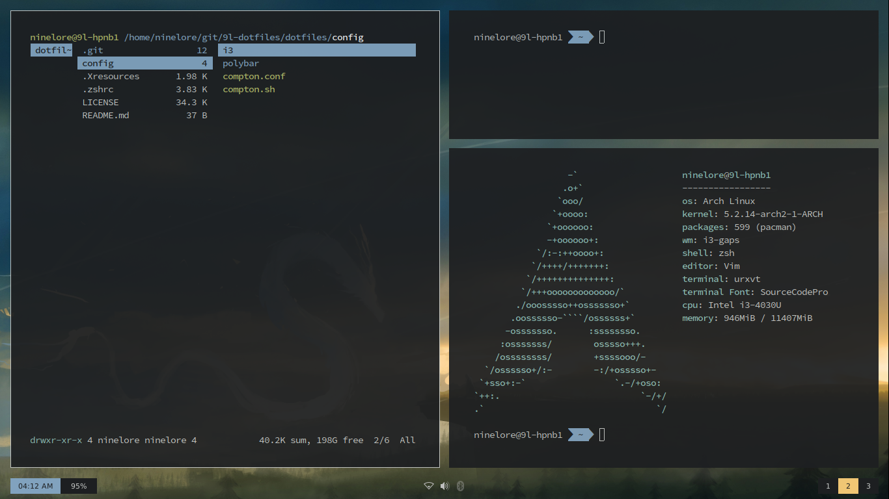

# ninelore's dotfiles
My Arch/Manjaro i3 dotfiles (WIP)

The Root of this repo resembles the Home Folder.
But be aware: This isnt complete as of now, be prepared to tinker around!

# Installation
**I recommend using the yay pacman/AUR wrapper. It's also required to use the package list txt coming soon to automaticly install all requirements**

required package list is coming soon/tba. Until then, read the config files for requirements

just put the files where they belong and adjust where needed

# FAQ
**Q:** What DM are u using?        **A:** none, I use xinitrc and I set tty1 to autologin and added a startx script to my .zprofile

# Credits
https://github.com/petvas/i3lock-blur

# Picture

