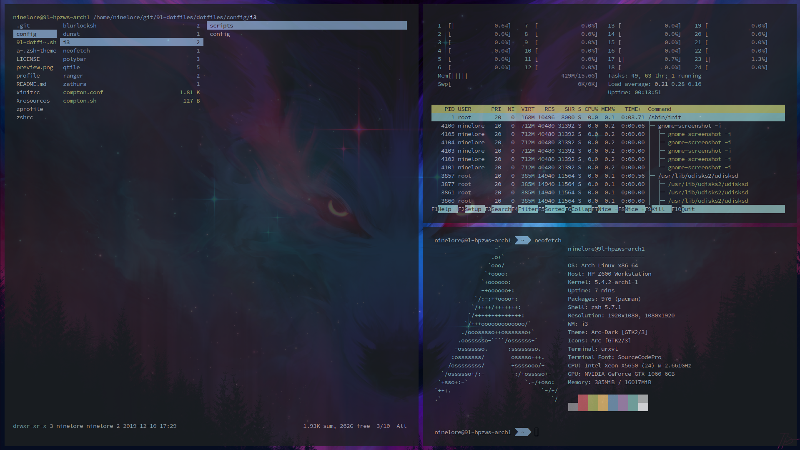
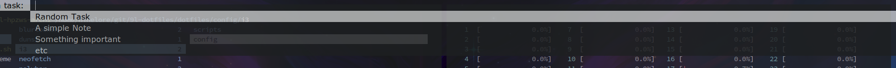

# ninelore's dotfiles
My Arch/Manjaro i3 dotfiles (WIP)

The Root of this repo resembles the Home Folder.
But be aware: This isnt complete as of now, be prepared to tinker around!

# Installation
**I recommend using the yay pacman/AUR wrapper. It's also required to use the package list txt coming soon to automaticly install all requirements**

The installation script is WIP!!!!. As of now it only installs dependencys over yay and installs oh-my-zsh

just put the files where they belong, add a dot to the files that belong directly to your home folder and adjust configs where needed

# FAQ
tbd

# Credits
https://github.com/petvas/i3lock-blur

# Picture (outdated)

